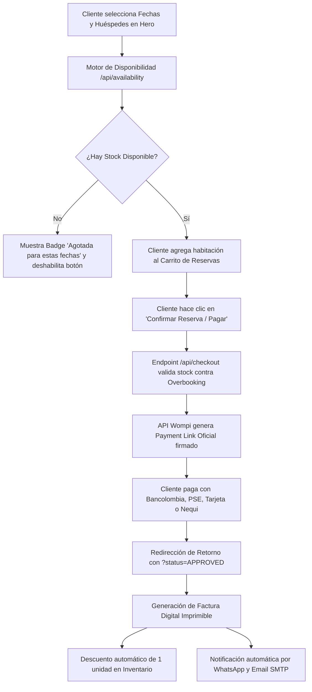

# 🏨 Hotel Punto Aparte — Plataforma Web Oficial de Reservas

> **Tu espacio de desconexión en el corazón de Quibdó, Chocó.**

---

## 🏨 Propuesta de Valor

El **Hotel Punto Aparte** redefine la experiencia de hospedaje en Quibdó (Chocó), combinando el confort contemporáneo de alto nivel con la calidez y hospitalidad auténtica chocoana. Ubicado estratégicamente en la zona comercial y cultural de la ciudad (a pocos pasos del pasaje peatonal Alameda Reyes, la Catedral San Francisco de Asís y el Malecón del Río Atrato), ofrece a sus huéspedes una estancia exclusiva, tranquila e insonorizada.

Nuestra infraestructura cuenta con **Certificación Oficial de Edificación Antisísmica**, garantizando los más altos estándares de seguridad estructural e ingeniería moderna. Disfruta de habitaciones ejecutivas y familiares climatizadas (Aire Acondicionado o Ventilador), conectividad Wi-Fi de alta velocidad, camas prémium y atención personalizada las 24 horas del día.

---

## 🛠️ Stack Tecnológico

| Capa / Categoría | Tecnologías & Librerías | Versión | Propósito en el Sistema |
|---|---|---|---|
| **Core Web Framework** | [Next.js](https://nextjs.org) (App Router, Turbopack) | `16.3.2` | Arquitectura híbrida SSR/CSR, optimización SEO automática y API Routes de alto rendimiento. |
| **UI Library** | [React](https://react.dev) & React DOM | `19.2.8` | Interfaz reactiva, renderizado concurrente y componentes basados en Hooks modernos. |
| **Lenguaje** | [TypeScript](https://www.typescriptlang.org) | `5.x` | Tipado estático estricto, modelado de dominios de reserva y prevención de errores en compilación. |
| **Estilos & Diseño** | [Tailwind CSS](https://tailwindcss.com) & PostCSS | `4.x` | Sistema visual Dark Mode, Glassmorphism, paleta dorada corporativa y diseño 100% responsivo. |
| **Iconografía** | [Lucide React](https://lucide.dev) | `1.33.0` | Set iconográfico moderno, accesible y optimizado para peso mínimo. |
| **Animaciones & UI Feedback** | [Framer Motion](https://www.framer.com/motion/) & [Sonner](https://sonner.emilkowal.ski/) | `13.x` / `2.x` | Transiciones fluidas, micro-interacciones y sistema de notificaciones toast. |
| **Visualización 360°** | [React Photo Sphere Viewer](https://photo-sphere-viewer.js.org) + [Three.js](https://threejs.org) | `6.2.3` / `0.185.1` | Motor WebGL inmersivo para tours virtuales panorámicos interactivos en 360° de las habitaciones. |
| **Pasarela de Pagos** | **Wompi (Bancolombia)** REST API | `v1` | Débito en línea Bancolombia, PSE, Tarjetas Débito/Crédito y Nequi mediante enlaces firmados seguros. |
| **Mensajería & Notificaciones** | **WhatsApp Business API** & [Nodemailer](https://nodemailer.com) | `9.0.5` | Canal de atención y reserva directa vía WhatsApp y emisión de facturas electrónicas por SMTP. |
| **Manejo de Estado** | **React Context API** (`CartContext`) | Nativo | Gestión global de carrito de compras, fechas seleccionadas y persistencia en `localStorage`. |
| **Control de Inventario** | Motor Propietario (`/src/lib/inventory.ts`) | Custom | Algoritmo de traslape de fechas y protección anti-overbooking para las 23 habitaciones del hotel. |

---

## 🚀 Guía de Instalación Local

### Requisitos Previos
* **Node.js**: Versión `18.18.0` o superior (se recomienda Node `20 LTS` o Node `22`).
* **Gestor de Paquetes**: `npm`, `pnpm` o `yarn`.
* **Git**: Instalado en tu entorno local.

### Paso 1: Clonar el Repositorio
```bash
git clone https://github.com/DevSuarez05/hotel-punto-aparte.git
cd hotel-punto-aparte
```

### Paso 2: Instalar Dependencias
```bash
npm install
```

### Paso 3: Configurar Variables de Entorno
Copia la plantilla de ejemplo y ajusta tus credenciales locales:
```bash
cp .env.example .env.local
```

### Paso 4: Iniciar el Servidor de Desarrollo
```bash
npm run dev
```
Abre tu navegador en [http://localhost:3000](http://localhost:3000) para interactuar con la plataforma en tiempo real.

---

## ⚙️ Variables de Entorno (`.env.local`)

Crea un archivo `.env.local` en la raíz del proyecto con la siguiente estructura de variables:

```env
# ============================================================================
# CREDENCIALES OFICIALES DE PASARELA WOMPI (BANCOLOMBIA)
# ============================================================================
# Llave Pública (Accesible desde cliente y servidor)
NEXT_PUBLIC_WOMPI_PUBLIC_KEY="pub_test_Q5yDA9xoKdePzhSGeVe9KStXTIIOxKKW"

# Llave Privada (Uso exclusivo del backend / API routes)
WOMPI_PRIVATE_KEY="prv_test_58YyR0k4xJ1k9rT2v8p0m4n6q7"

# Secreto de Integridad y Webhooks (Firmas criptográficas HMAC-SHA256)
WOMPI_INTEGRITY_EVENTS_SECRET="test_integrity_4C0L0MB1A_PUNT0APART3_S3CR3T_K3Y"

# ============================================================================
# CONFIGURACIÓN DE REDIRECCIÓN Y URL BASE
# ============================================================================
# URL de retorno tras finalizar la transacción en la pasarela
NEXT_PUBLIC_WOMPI_REDIRECT_URL="http://localhost:3000"

# URL base de la aplicación (Localhost para pruebas locales)
NEXT_PUBLIC_APP_URL="http://localhost:3000"

# URL base pública dinámica (Opcional: para túneles Cloudflare/Ngrok o dominio de producción)
# NEXT_PUBLIC_BASE_URL="https://hotelpuntoaparte.com"

# ============================================================================
# CONFIGURACIÓN DE CONTACTO Y WHATSAPP
# ============================================================================
NEXT_PUBLIC_WHATSAPP_NUMBER="573018940859"
NEXT_PUBLIC_HOTEL_CITY="Quibdó, Chocó"

# ============================================================================
# CONFIGURACIÓN SMTP (Facturación por Correo Opcional con Nodemailer)
# ============================================================================
SMTP_HOST="smtp.gmail.com"
SMTP_PORT=587
SMTP_SECURE=false
SMTP_USER="recepcion@hotelpuntoaparte.com"
SMTP_PASS="tu_password_de_aplicacion"
```

---

## 📁 Estructura del Proyecto

```
hotel-punto-aparte/
├── public/                       # Recursos estáticos servidos públicamente
│   ├── assets/images/hotel/      # Galería fotográfica oficial real del hotel
│   ├── images/                   # Logotipos corporativos y assets limpios
│   └── rooms/                    # Panoramas WebGL para vistas 360°
├── src/
│   ├── app/                      # Next.js App Router (Rutas y Endpoints)
│   │   ├── api/
│   │   │   ├── availability/     # GET/POST: Consulta de stock en tiempo real por fechas
│   │   │   ├── checkout/         # POST: Creación de órdenes y Payment Links con Wompi
│   │   │   └── payments/         # Endpoints complementarios y Webhooks
│   │   ├── globals.css           # Configuración de Tailwind CSS v4, Dark Mode y @media print
│   │   ├── layout.tsx            # Layout raíz con Providers, fuentes Google y SEO JSON-LD
│   │   └── page.tsx              # Landing Page principal integrada
│   ├── components/               # Componentes modulares UI
│   │   ├── CartDrawer.tsx        # Drawer lateral del carrito de reservas
│   │   ├── CheckoutModal.tsx     # Modal de checkout, validación de datos y factura digital
│   │   ├── ContactSection.tsx    # Formulario de contacto directo y canal WhatsApp
│   │   ├── Footer.tsx            # Pie de página con información legal y enlaces
│   │   ├── Gallery.tsx           # Galería interactiva con modal Lightbox
│   │   ├── Hero.tsx              # Encabezado principal con buscador dinámico de fechas
│   │   ├── HotelLogo.tsx         # Componente de identidad corporativa optimizado
│   │   ├── LobbyShowcase.tsx     # Recepción interactiva con puntos de interés (hotspots)
│   │   ├── LocationMap.tsx       # Localización satelital y sitios de interés en Quibdó
│   │   ├── Navbar.tsx            # Barra de navegación fija con menú móvil responsivo (z-999)
│   │   ├── PanoramaViewer.tsx    # Visor interactivo WebGL en 360°
│   │   ├── RoomModal.tsx         # Modal de detalle y tour 360° de la habitación
│   │   ├── RoomsSection.tsx      # Catálogo de habitaciones con filtros y stock en vivo
│   │   └── WhatsAppButton.tsx    # Botón flotante para atención inmediata
│   ├── context/
│   │   └── CartContext.tsx       # Estado global de carrito, cálculo de noches y huéspedes
│   ├── data/
│   │   ├── config.ts             # Datos oficiales de la empresa, ubicación y políticas
│   │   ├── payments.ts           # Modelos de documentos y validaciones colombianas
│   │   └── rooms.ts              # Inventario oficial de 23 habitaciones y 4 categorías
│   └── lib/
│       ├── inventory.ts          # Motor de disponibilidad, traslape de fechas y anti-overbooking
│       └── wompi.ts              # Firmas criptográficas HMAC-SHA256 y utilidades Wompi
├── next.config.ts                # Configuración de Next.js, optimización de imágenes y cabeceras
├── package.json                  # Dependencias y scripts de ejecución
└── tsconfig.json                 # Configuración de compilación TypeScript
```

---

## 💳 Flujo de Reservas y Pagos



1. **Búsqueda & Consulta**:
   * El cliente selecciona fecha de entrada, salida y número de huéspedes en el buscador del `Hero`.
   * El sistema calcula las noches y consulta el endpoint `/api/availability` para obtener las unidades libres en tiempo real.
2. **Validación de Stock & Carrito**:
   * El catálogo en `RoomsSection` muestra el badge dinámico de disponibilidad (`🟢 X disponible(s)` o `🔴 AGOTADA PARA ESTAS FECHAS`).
   * El cliente añade su acomodación al carrito; el sistema calcula el valor total en pesos colombianos (`COP`).
3. **Checkout con Wompi**:
   * Al confirmar la reserva, `/api/checkout` ejecuta una llamada server-to-server (`POST /v1/payment_links`) utilizando la llave privada de Wompi.
   * Wompi responde con un enlace seguro firmado (`https://checkout.wompi.co/l/{ID}`), redirigiendo al cliente a la pasarela bancaria.
4. **Confirmación, Factura & Notificaciones**:
   * Una vez aprobado el pago, el cliente regresa al sitio web (`?status=APPROVED`), donde se genera la **Factura Electrónica Digital** con número de referencia único.
   * Se descuenta automáticamente la unidad del inventario del hotel y se envía la confirmación vía **WhatsApp Business** y correo electrónico con **Nodemailer**.

---

## 🌐 Instrucciones de Despliegue

### Opción 1: Despliegue en Vercel (Recomendado)

1. Sube tu código al repositorio en GitHub.
2. Ingresa a [Vercel Dashboard](https://vercel.com) y selecciona **"Add New Project"**.
3. Importa el repositorio `hotel-punto-aparte`.
4. En la sección **Environment Variables**, añade todas las variables definidas en tu archivo `.env.local` (`NEXT_PUBLIC_WOMPI_PUBLIC_KEY`, `WOMPI_PRIVATE_KEY`, `WOMPI_INTEGRITY_EVENTS_SECRET`, etc.).
5. Haz clic en **"Deploy"**. Vercel compilará automáticamente con Turbopack y publicará la web con CDN global y certificado SSL HTTPS.

### Opción 2: Vinculación de Dominio Personalizado en Spaceship

1. En el panel de **Vercel**, ve a **Settings > Domains**.
2. Escribe tu dominio registrado en Spaceship (ej: `hotelpuntoaparte.com` y `www.hotelpuntoaparte.com`).
3. Ingresa a tu cuenta en [Spaceship](https://www.spaceship.com) y dirígete a **Domain Management > Advanced DNS**.
4. Agrega los siguientes registros DNS proporcionados por Vercel:
   * **Registro A**:
     * **Host / Nombre**: `@`
     * **Tipo**: `A`
     * **Valor / IP**: `76.76.21.21`
     * **TTL**: Automático / 300
   * **Registro CNAME**:
     * **Host / Nombre**: `www`
     * **Tipo**: `CNAME`
     * **Valor**: `cname.vercel-dns.com.`
     * **TTL**: Automático / 300
5. Espera la propagación DNS (entre 5 y 30 minutos). Vercel generará automáticamente el certificado SSL gratuito Let's Encrypt para tu dominio en Spaceship.

### Opción 3: Despliegue en Servidor VPS / Node.js
```bash
# 1. Compilar para producción
npm run build

# 2. Iniciar el servidor Node.js
npm run start
```

---

## 📞 Soporte & Contacto Comercial

* **Hotel**: Hotel Punto Aparte
* **Titular**: José Raúl Gómez Botero
* **Ubicación**: Quibdó, Chocó — Colombia
* **WhatsApp de Reservas**: +57 301 894 0859
* **Correo Corporativo**: recepcion@hotelpuntoaparte.com
